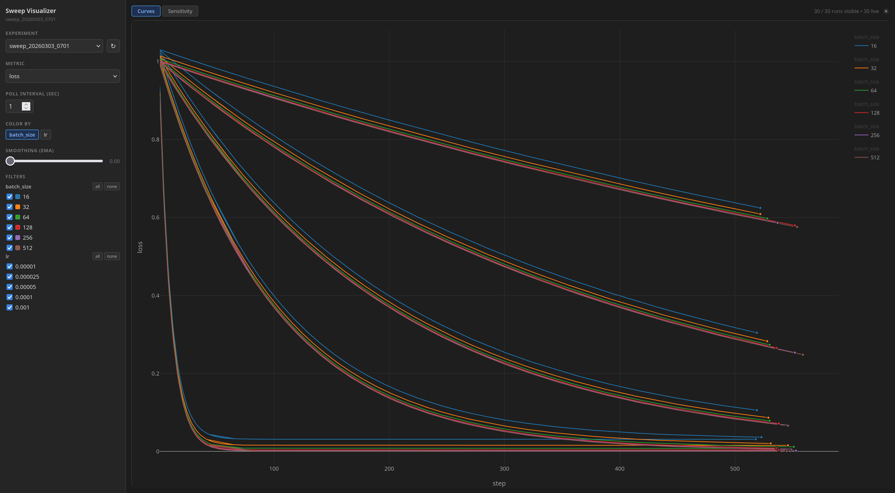

# mlsweep

`mlsweep` is slightly opinionated but very general solution for managing tons of machine learning runs. It takes flexible combinations of hyperparameters and schedules them across your hardware.

The project contains a controller which manages scheduling jobs across workers, and a visualizer. You aren't forced to use our visualizer. You can use mlsweep with the wandb or tensorboard logger, and the mlsweep metrics format can be exported to wandb or tensorboard. The mlsweep logger is also extensible, should you wish. Logs end up on the controller machine.

The main feature of mlsweep is not the logger, but the sweep configuration file. The good stuff. The thing that I've been missing all my machine learning life, and the reason I wrote this library.

`mlsweep` does pretty much everything that wandb does. If you're missing anything, let me know on [Discord](https://discord.gg/w2K2JWJGUb) or [Twitter](https://twitter.com/apaz_cli).



But first, let's install it, and add the logging.

## Setup

```sh
git clone <your-project>
cd <your-project>
python -m venv .venv
pip install 'mlsweep[all]'
```

## Add logging to your training script

```python
from mlsweep.logger import MLSweepLogger

# If you don't want to use it as a context manager, remember to call .close().
with MLSweepLogger() as logger:
    for step in range(1, num_steps + 1):
        loss = train_step()
        logger.log({"loss": loss}, step=step)

        # Write checkpoints to MLSWEEP_RUN_DIR — they get rsynced back automatically.
        # Call logger.sync() to trigger an immediate rsync mid-run (fire-and-forget).
        if step % 1000 == 0:
            # If your checkpoint saving is asynchronous remember to launch a thread to await a future and then sync or something.
            # logger.sync() is async and nonblocking but needs to be called after the artifact dir is ready.
            save_checkpoint(os.environ["MLSWEEP_RUN_DIR"], step)
            logger.sync()
```

This logging is usually a no-op when run outside of `mlsweep_run`. Metrics land in `outputs/sweeps/<experiment>/<run>/metrics.jsonl`. Anything written to `MLSWEEP_RUN_DIR` is rsynced to `outputs/sweeps/<experiment>/<run>/artifacts/` — at the end of every run, and immediately on `logger.sync()`.

## Write a sweep configuration file

Add the following shebang, and use `chmod +x` so that that your sweep file can be directly executable.

```python
#!/usr/bin/env mlsweep_run

COMMAND = ["python", "train.py"]

OPTIONS = {
    ".lr": {
        "values": [1e-4, 3e-4, 1e-3],
        "flags": "--optimizer.lr",
        "name": "lr",
    },
    ".batch_size": {
        "values": [32, 64, 128],
        "flags": "--training.batch_size",
        "name": "bs",
    },
}
```

Running this produces 9 runs named `my_sweep_lr1e-4_bs32`, `my_sweep_lr1e-4_bs64`, etc.

Each run receives its flags appended to `COMMAND`: `python train.py --optimizer.lr 0.0001 --training.batch_size 32`.

See [sweep_configuration.md](docs/sweep_configuration.md) for the full format: subdimensions, monotonic/singular skipping, `EXCLUDE`, `GPUS_PER_RUN` for training with `torchrun`, and more.

## Bayesian optimization

If your sweep is specifically for hyperparameter optimization, you can add an `OPTIMIZE` dict to save compute — it uses TPE (via optuna) to intelligently sample the space and find good configs faster than trying all combinations.

```python
#!/usr/bin/env mlsweep_run

COMMAND = ["python", "train.py"]

OPTIMIZE = {
    "method": "bayes",
    "metric": "val_loss",
    "goal": "minimize",
    "budget": 40,
}

OPTIONS = {
    # Discrete dim
    ".optimizer": {
        "name": "opt",
        ".adam": {"flags": ["--optimizer", "adam"]},
        ".muon": {"flags": ["--optimizer", "muon"]},
    },
    # Continuous dims
    ".lr": {
        "distribution": "log_uniform",
        "min": 1e-5,
        "max": 1e-1,
        "flags": "--optimizer.lr",
        "name": "lr",
    },
    ".wd": {
        "distribution": "log_uniform",
        "min": 0.0,
        "max": 0.2,
        "flags": "--optimizer.weight_decay",
        "name": "wd",
    },
}
```

Requires `pip install 'mlsweep[bayes]'` (should be installed if you install `'mlsweep[all]'`).

Run the same way as any other sweep:

```sh
mlsweep_run sweeps/bayes_sweep.py -g 4
```

See [sweep_configuration.md](docs/sweep_configuration.md) for continuous ranges, singular dims, and all `OPTIMIZE` fields.

## Run

### Local

```sh
mlsweep_run sweeps/my_sweep.py             # 1 GPU
mlsweep_run sweeps/my_sweep.py -g 4        # 4 GPUs in parallel
mlsweep_run sweeps/my_sweep.py -g          # all visible GPUs
mlsweep_run sweeps/my_sweep.py -g 4 -j 5   # 5 jobs per GPU (20 total)
```

### Remote workers

#### 1. Install mlsweep on each remote machine

```sh
ssh user@host -i path/to/key
cd path/to/project/
pip install mlsweep
```

#### 2. Create a workers.toml with your remote worker

```toml
[[workers]]
host = "user@host1"
remote_dir = "/absolute/path/to/project"
ssh_key = "~/.ssh/id_ed25519"
venv = "/absolute/path/to/venv/"          # Optional, resolves .venv/, venv/, calls bin/activate, defaults to remote_dir
devices = [0, 1, 2, 3]                    # Sets CUDA_VISIBLE_DEVICES/HIP_VISIBLE_DEVICES
jobs = 2
```

|    Field     | Required | Notes |
|--------------|----------|-------|
| `host`       | yes      | SSH target |
| `remote_dir` | yes      | Project root on the remote |
| `ssh_key`    | no       | Path to identity file (`-i`) |
| `pass`       | no       | SSH password (needs `sshpass`); or set `MLSWEEP_SSH_PASS` env var |
| `venv`       | no       | Venv locator (default: `remote_dir`). Accepts a project root, venv root, `bin/` dir, activate script, or python binary. |
| `devices`    | no       | Specific GPU IDs to use |
| `gpus`       | no       | Total GPU count -g (default: all visible) |
| `jobs`       | no       | Concurrent jobs per GPU slot -j (default: 1) |

**`venv` accepts any of:**
- Project root containing `.venv/` or `venv/`
- Venv root directory (contains `bin/mlsweep_worker`)
- `bin/` directory
- Path to `activate` script
- Path to a python binary

#### 3. Run

```sh
mlsweep_run sweeps/my_sweep.py --workers workers.toml
```

## Visualize

Once you've launched the sweep, on the machine and in the dir you called `mlsweep_run` from, run:

```bash
mlsweep_viz
# or
mlsweep_viz experiment_name
```

This will prompt you to open up a browser (or pass --open-browser to do so automatically) to see the sweep visualizer.
It will watch your experiment folder and update the metrics viewer in real time.

### Using with W&B

mlsweep can log all runs to Weights & Biases with no changes to your training script. The controller owns the W&B session — your training script only calls `MLSweepLogger` as usual.

Install the extra:

```sh
pip install 'mlsweep[wandb]'
```

Then pass `--wandb-project` when launching:

```sh
export WANDB_API_KEY=your_key_here
mlsweep_run sweeps/my_sweep.py -g 4 --wandb-project my-project
mlsweep_run sweeps/my_sweep.py -g 4 --wandb-project my-project --wandb-entity my-team
```

Each run appears in W&B under the project, grouped by experiment name, with its hyperparameter combo stored as the run config.

### Using with TensorBoard

Same idea — no changes to your training script needed.

Install the extra (or use an existing torch/tensorboardX install):

```sh
pip install 'mlsweep[tensorboard]'
```

Then pass `--tensorboard-dir` when launching:

```sh
mlsweep_run sweeps/my_sweep.py -g 4 --tensorboard-dir ./tb_logs
```

Logs are written to `<tensorboard-dir>/<experiment>/<run>/`. Point TensorBoard at the top-level dir to compare all runs:

```sh
tensorboard --logdir ./tb_logs
```

## Troubleshooting

If the error messages are bad or the docs are bad or you feel confused feel free to hit me up on [Discord](https://discord.gg/w2K2JWJGUb) or [Twitter](https://twitter.com/apaz_cli).
